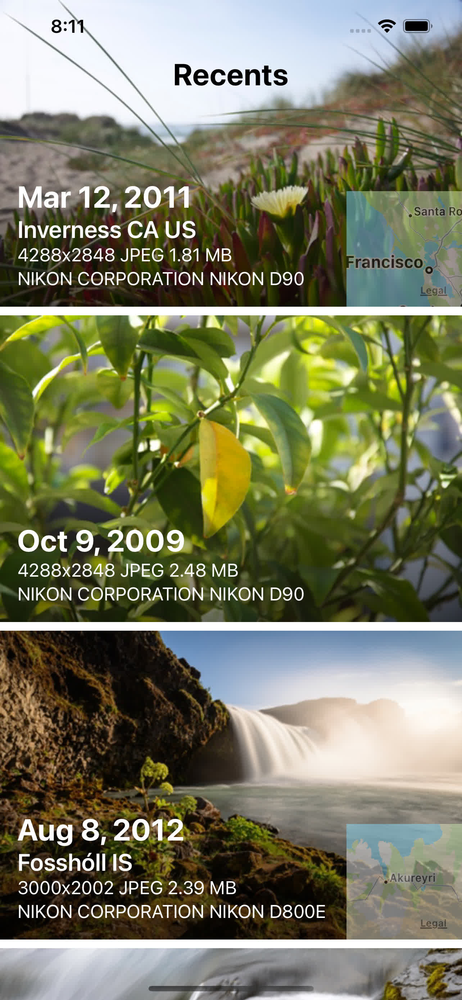

# Photo Album Browser

Example SwiftUI app demonstrating use of the Photos framework and CoreImage to load images
and metadata from the photo library.

Configure a specific user-defined album using the
_album_name_ property in the Info.plist. If not found, the app will display the contents of
the first smart album it finds, usually the camera roll, e.g. on a simulator.

Tapping individual cells toggles the overlay on each photo.

Live photos are displayed using a PHLivePhotoView. Dismiss the overlay by tapping and then long press the PHLivePhotoView to play the video contents.

